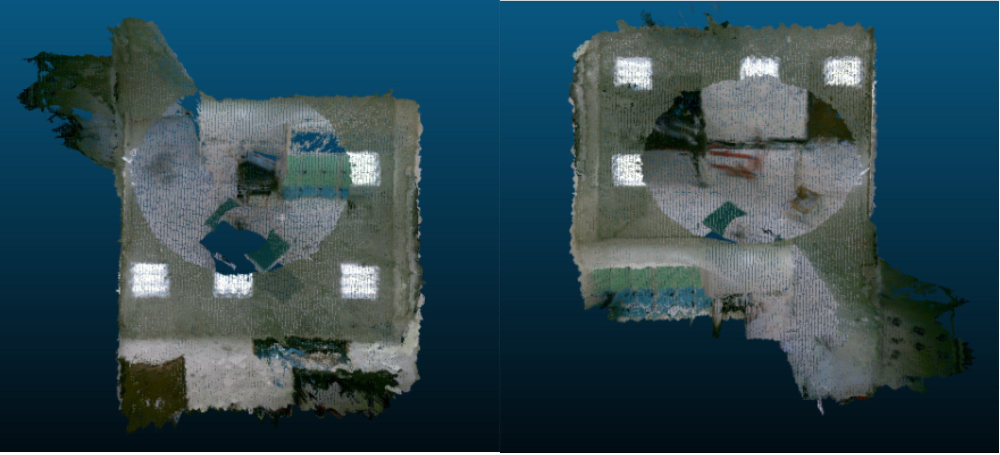
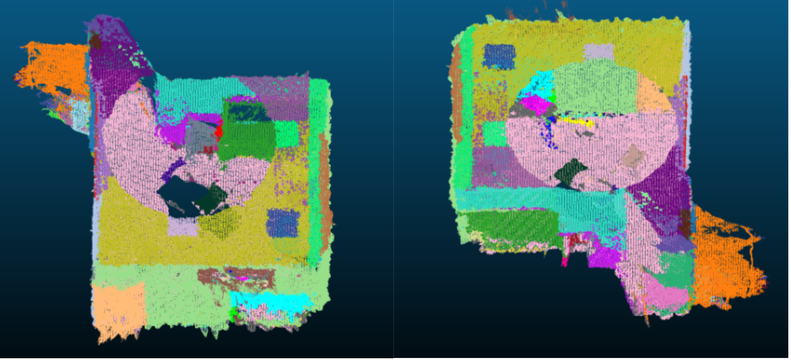
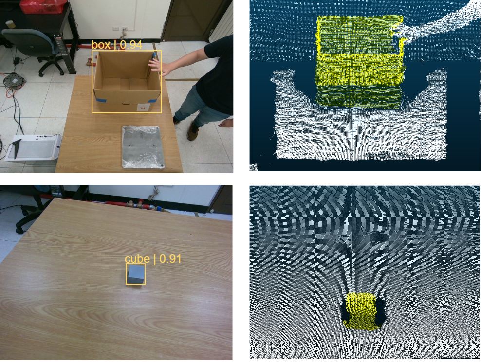
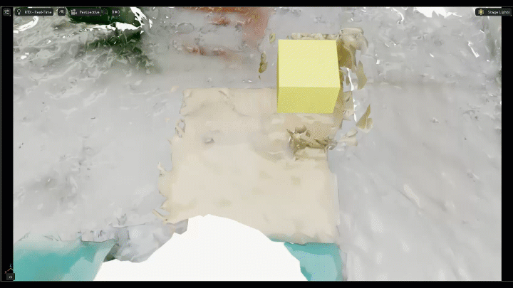
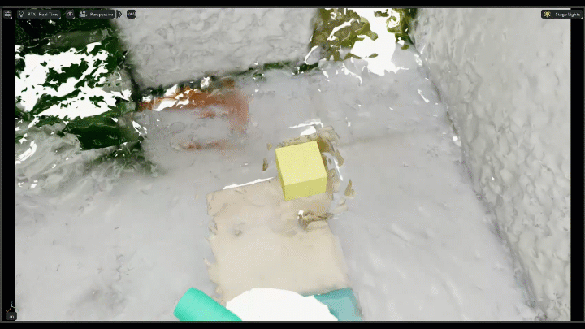
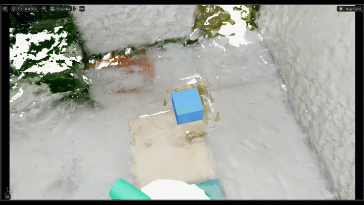

# Vision-Guided Robotic Manipulation in Dynamic Workspaces

<p align="center">
  
</p>

<p align="center">
  <b>Bo-Ya Wang</b> · <b>Leon Lin</b> · <b>Bryan D. Tan</b>
</p>

<p align="center">
  Vision-guided robotic manipulation using a single RGB-D camera, digital twins, and physics-based motion prediction.
</p>

---

## Overview

Traditional robotic manipulation systems are designed for controlled environments where object locations remain fixed and predictable. This project investigates whether a robot equipped with only an eye-in-hand RGB-D camera can operate effectively in dynamic environments.

The proposed framework combines:

* Multi-view RGB-D scanning
* 3D Digital Twin construction
* Scene understanding
* Object identification
* Physics-based motion prediction
* Dynamic object placement

to pick a static object and place it into a moving target.

---

## Project Video

<p align="center">
  <a href="https://github.com/user-attachments/assets/6cf73f77-72a3-493c-8a14-e53f06ffb417">
    
  </a>
</p>

<p align="center">
  <a href="https://github.com/user-attachments/assets/6cf73f77-72a3-493c-8a14-e53f06ffb417">
    🎥 Watch Full Video
  </a>
</p>

---

# Pipeline

```text
Environment Scan
        ↓
Scene Reconstruction
        ↓
Object Identification
        ↓
Grasp Target
        ↓
Move to Sentry Position
        ↓
Motion Prediction
        ↓
Dynamic Placement
```

<p align="center">
  
</p>

---

# Experimental Setup

## Hardware

| Component | Description          |
| --------- | -------------------- |
| Robot Arm | Techman TM-20        |
| Gripper   | OnRobot 2FG7         |
| Camera    | Intel RealSense D455 |
| Simulator | NVIDIA Isaac Lab     |

---

## Task Description

### Pick Target

* Static 3D-printed cube

### Place Target

* Cardboard container
* Moving along a predefined trajectory

### Constraints

* Single RGB-D sensor
* No external tracking system
* Dynamic placement target

---

# Scene Understanding

## Environment Scan

The robot performs a structured scan of the workspace using multiple viewpoints at different heights and pitch angles.

<!-- <p align="center">
  
</p> -->

<p align="center">
  
</p>

---

## TSDF Reconstruction

RGB and depth observations are fused into a dense point cloud using TSDF Fusion.

<p align="center">
  
</p>

---

## Segment Anything 3D

Segment Anything 3D separates semantic regions of the scene for downstream analysis.

<p align="center">
  
</p>

---

# Object Identification

Object grounding combines:

* RGB observations
* Segmented point clouds
* Vision-language reasoning

to identify:

* Grasp target
* Place target

<p align="center">
  
</p>

---

# Dynamic Manipulation

## Grasp & Sentry

The robot first grasps the cube and then moves into a sentry position where the moving target remains visible, below is the view of the moving object from the sentry position.

<!-- <p align="center">
  
</p> -->

<p align="center">
  
</p>

---

# Physics-Based Motion Prediction

The observed target motion is transferred into the Isaac Lab digital twin and used to predict future target locations.

<p align="center">
  
</p>

---

## Kalman-Based Motion Prediction

Suitable for short prediction horizons.

<p align="center">
  
</p>

### State Model

$$
\mathbf{x}_k =
\begin{bmatrix}
x_k & y_k & v_{x,k} & v_{y,k} & a_{x,k} & a_{y,k}
\end{bmatrix}^{T}
$$

### Future Prediction

$$
\hat{\mathbf{p}}_{drop}
=
\begin{bmatrix}
\hat{x}(t_0+t_m) \\
\hat{y}(t_0+t_m)
\end{bmatrix}
$$

$$
\hat{\mathbf{x}}(t_0+t_m)
=
\mathbf{F}(t_m)\hat{\mathbf{x}}(t_0)
$$

---

## Oscillator-Based Motion Prediction

Suitable for periodic target motions and longer prediction horizons.

<p align="center">
  
</p>

### Oscillator Model

$$
s(t)=A\sin(\omega t+\phi)+c
$$

### Future Prediction

$$
s(t_0+t_m)
=
A\sin(\omega(t_0+t_m)+\phi)+c
$$

$$
\hat{\mathbf{p}}_{drop}
=
\mathbf{p}_c + s(t_0+t_m)\mathbf{u}
$$

---

## Simulated Run

<p align="center">
  
</p>

---

# Key Findings

* Kalman-based prediction performs best for short prediction horizons.
* Oscillator-based prediction performs best for periodic motions and longer prediction horizons.
* A single RGB-D sensor can provide sufficient scene information when coupled with a structured scanning procedure.
* Physics-based prediction enables object placement into moving targets.
* Prediction failures occur most frequently near motion reversal points.

---

# Limitations

* Prediction accuracy decreases near motion reversal points.
* Dynamic obstacles are not currently considered.
* The framework assumes target motion can be approximated by simple kinematic or periodic models.

---

# Future Work

* Closed-loop visual servoing
* Multi-object dynamic manipulation
* Learned trajectory prediction models
* Multi-camera scene understanding
* Real-time digital twin synchronization

---
